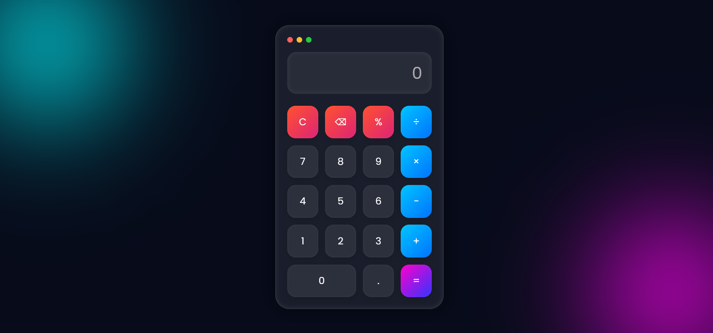

# Modern Calculator

A sleek and modern calculator web application built using HTML, CSS, and JavaScript with a beautiful glassmorphism UI design and fully responsive layout.

## Live Demo
[View Live Project](https://modern-calculater-oewy.vercel.app/)  

## Features

- Modern glassmorphism design
- Fully responsive (mobile + desktop)
- Keyboard support
- Smooth animations
- Basic arithmetic operations (+, -, *, /)
- Clean and minimal interface

## Screenshots

## Screenshots

## Tech Stack

- HTML5
- CSS3
- Vanilla JavaScript

## Author

**Abiha Nadeem**
